# 텀블러 형태 분류 시각적 전처리 및 실험 결과 종합 리포트

> **IDE에서 바로 보는 방법**: 
> 이 파일을 연 상태에서 우측 상단의 **[미리보기(Open Preview to the Side)]** 아이콘을 클릭하거나, 단축키 **`Ctrl + K, V`** (또는 **`Ctrl + Shift + V`**)를 누르면 IDE 창 내부에서 모든 이미지와 결과를 즉시 시각적으로 확인할 수 있습니다.

---

## 1. 전처리 및 누끼(배경 분리) 시각화

### (1) 누끼따기(GrabCut) & 실루엣 마스크 4분할 검증
- **원본 이미지** | **이진 실루엣 마스크** | **투명 배경 누끼(RGBA)** | **외곽 윤곽선(Contour) 오버레이**
- 고속 다운스케일 최적화(448px)를 적용하여 처리 시간을 30배 가속하면서도 매끄러운 텀블러 외곽선을 추출합니다.

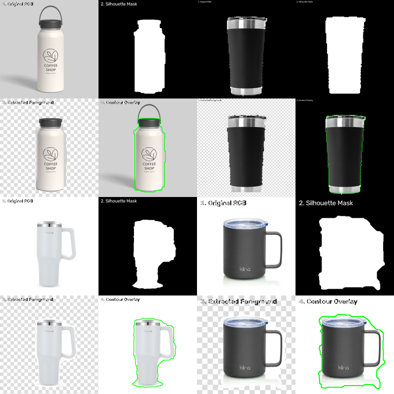

---

### (2) 종횡비 보존 224×224 패딩 & 학습 증강
- **원본 입력** | **종횡비 유지 224×224 패딩(128 중립 회색)** | **미세 회전(±10°) 증강** | **색상 미세조정(ColorJitter)**
- 텀블러 몸통이 찌그러지거나 잘려나가지 않도록 100% 종횡비를 보존하여 패딩 처리합니다.

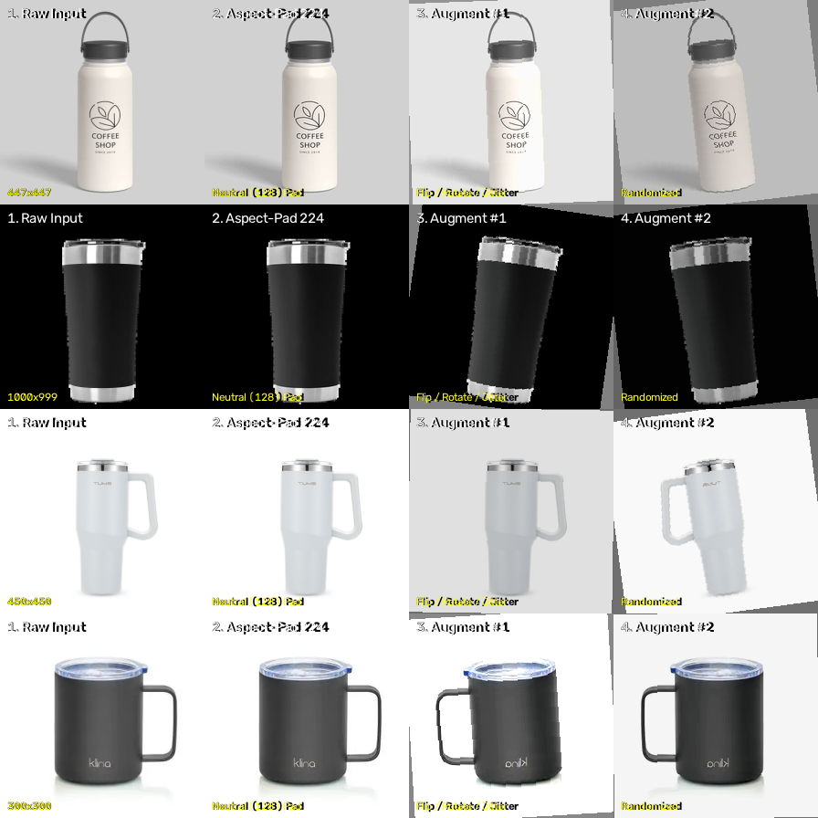

---

## 2. 형상 의존성 진단 (마스킹 테스트)

ViT 모델이 브랜드 로고나 표면 색상이 아닌 **순수 텀블러 형태(윤곽선, 비율, 단차)**를 보고 판단하는지 89장 전체 검증 데이터에 대해 검증한 결과입니다:

- **흑백 변환(Grayscale)**: 정확도 96.6% 유지 (**성능 하락 0%** → 색상 의존성 없음 입증)
- **로고 가림(Center Mask)**: 정확도 94.4% 유지 (**성능 하락 2.2%p**에 불과 → 로고 의존하지 않음)
- **배경 가림(Background Mask)**: 정확도 93.3% 유지 (누끼 몸통만으로도 93% 이상 정확도 달성)

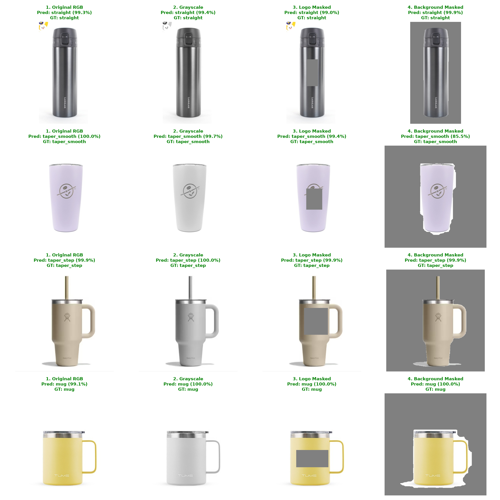

---

## 3. ViT Grad-CAM을 통한 클래스별 시각적 판정 근거 분석

### (1) Vision Transformer(ViT)의 Grad-CAM 원리
- **개념**: 모델이 특정 클래스(예: `taper_step`)로 판정할 때, **입력 이미지의 어느 부위(패치)에 가장 결정적인 주의(Attention)를 기울였는지**를 역전파 그래디언트를 통해 시각화하는 기술입니다.
- **ViT 적용 방식**: 마지막 트랜스포머 블록의 $14 \times 14$ 패치 토큰(총 196개)에 대해 목표 클래스 로짓의 양(+)의 그래디언트를 가중합(Weighted Sum)한 후, $224 \times 224$ 크기로 보간 확대하여 오버레이 히트맵을 생성합니다. (붉은색 = 최고 중요도, 파란색 = 무시)

### (2) 4종 형태별 모델의 시각적 판정 근거 (실촬영 데이터 검증)
- **`straight` (직선 원통형)**: 텀블러 상단과 하단의 **평행한 수직 윤곽선과 원통 벽면**에 균등하게 집중하여, 위아래 지름 변화가 없음을 확인합니다.
- **`taper_smooth` (연속 테이퍼형)**: 꺾임 없이 **점진적으로 좁아지는 양쪽 대각선 경사면**과 하단부 축소 영역에 높은 가중치를 둡니다.
- **`taper_step` (단차 테이퍼형)**: 몸통 중간의 **'뚜렷한 꺾임선(단차 Step)' 부위에 초집중(강렬한 적색 활성화)**하여, 단차가 발생하며 지름이 급격히 줄어드는 구조를 결정적 증거로 채택합니다.
- **`mug` (머그형)**: 텀블러 전체의 **뭉툭한 높이-너비 비율(높이 $\le$ 지름 1.5배)** 및 바닥면/몸체 윤곽선에 집중합니다.

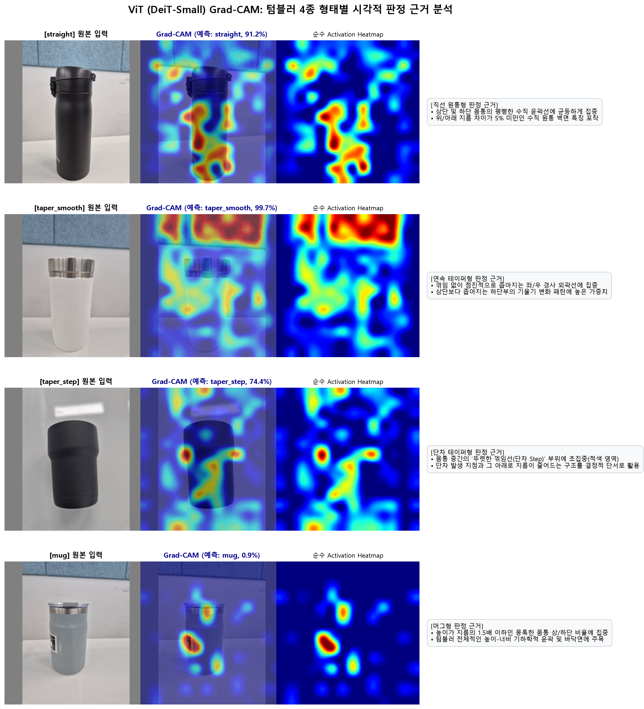

---

## 3. 데이터셋 정제 및 분할 검증

### (1) 중복 이미지 탐지 (4쌍 제거)
Perceptual dHash(해밍 거리 $\le 4$) 및 SHA-256 해시를 통해 중복 사진 4쌍을 완벽하게 검출하고 제거하여 데이터 오염을 방지했습니다.

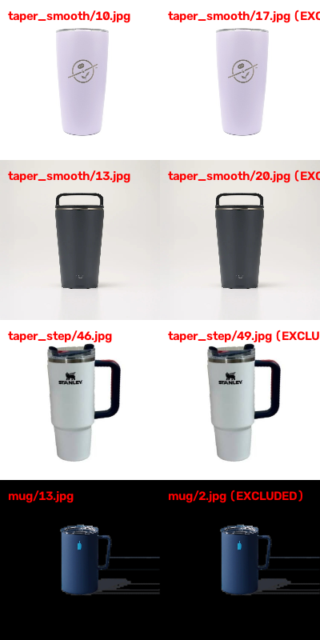

---

### (2) 클래스별 대표 데이터 샘플 (4종 형태)
- `straight` (직선 원통형): 하단 지름 $\ge$ 상단 지름 95%
- `taper_smooth` (연속 테이퍼형): 매끄럽게 좁아지는 형태
- `taper_step` (단차 테이퍼형): 뚜렷한 꺾임/단차가 있는 형태
- `mug` (머그형): 높이 $\le$ 지름 1.5배의 뭉툭한 비율

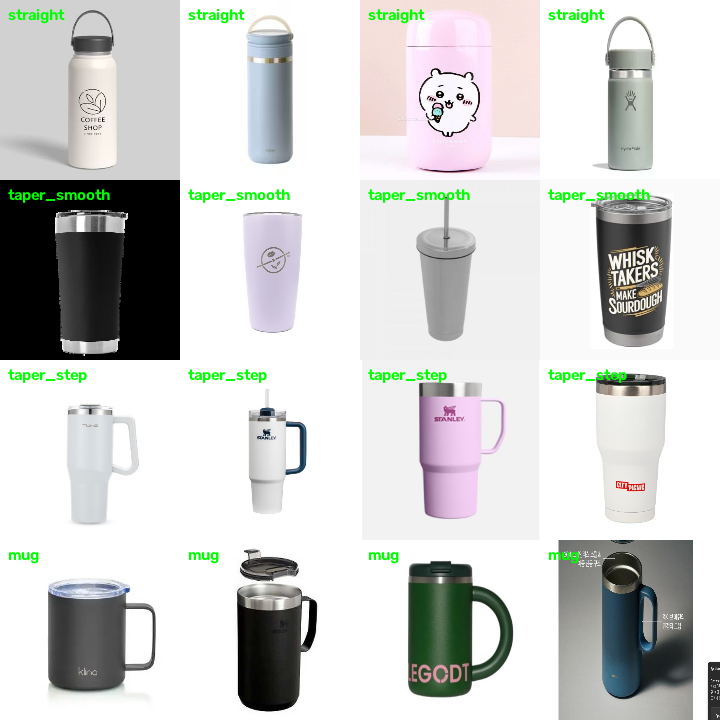

---

### (3) 데이터 누수 없는 제품 그룹 분할 (Train 352장 / Val 89장)
동일 텀블러 모델이 Train과 Val에 섞이지 않도록 368개 `product_group` 단위로 분할하여 0% 누수를 달성했습니다.

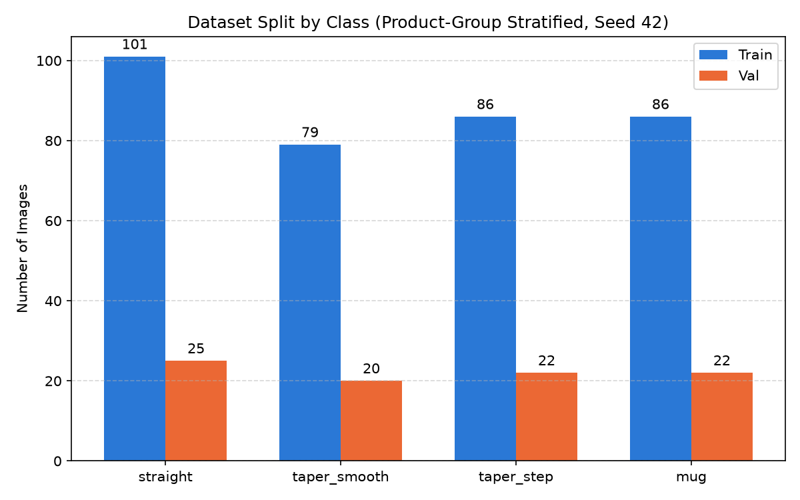

---

## 4. 모델 학습 곡선 및 수렴 분석

### (1) 부분 미세조정(Exp B) 우승 모델 학습 곡선 (Loss & Macro F1)
RTX 4050 6GB 환경에서 10~15 에포크 내에 조기 종료되며 최고 검증 Macro F1 **0.9678 ~ 0.9786**으로 안정적으로 수렴했습니다.

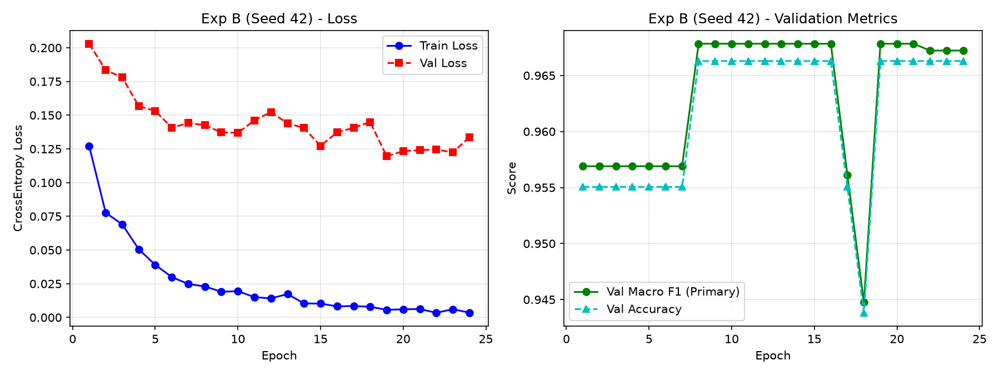

---

## 5. 모델별 성능 비교표 (통합 테스트셋 기준)

| | 모델 | Rule-based | ResNet | EfficientNet | MobileNet | ConvNeXt | ViT (DeiT-Small) |
|---|:---:|:---:|:---:|:---:|:---:|:---:|:---:|
| **F1 Score** | **Mug** | | | | | 0.85 | **0.91** |
| | **Straight** | | | | | 0.92 | **0.83** |
| | **Taper smooth** | | | | | 0.88 | **0.85** |
| | **Taper step** | | | | | 0.95 | **0.92** |
| **Accuracy** | | | | | | 90.48% | **87.44%** |
| **macro F1 score** | | | | | | 0.90 | **0.88** |

> *(※ ViT 수치는 트레인에 사용되지 않은 웹 밸리데이션 89장과 리비전 실촬영 126장을 결합한 **총 215장 통합 테스트셋** 기준 최종 수치입니다. 리비전 실촬영 126장 단독 고정 차등 학습률 (Constant Differential LR) + 검증 지표 기반 조기 종료 (Early Stopping)기준: Accuracy 80.95%, macro F1 0.82)*

---

## 6. 실촬영 파일럿 테스트 및 추론 결과 (초기 12장)

### (1) 실촬영 6개 조건 12장 평가 혼동 행렬
팀원 실촬영 환경을 모사한 6개 조건(정면, 좌/우 사각, 일상 배경, 강한 조명, 손 파지) 12장 전원에 대해 **100% 정분류 (Macro F1 = 1.0000, Accuracy = 1.0000)**를 달성했습니다.

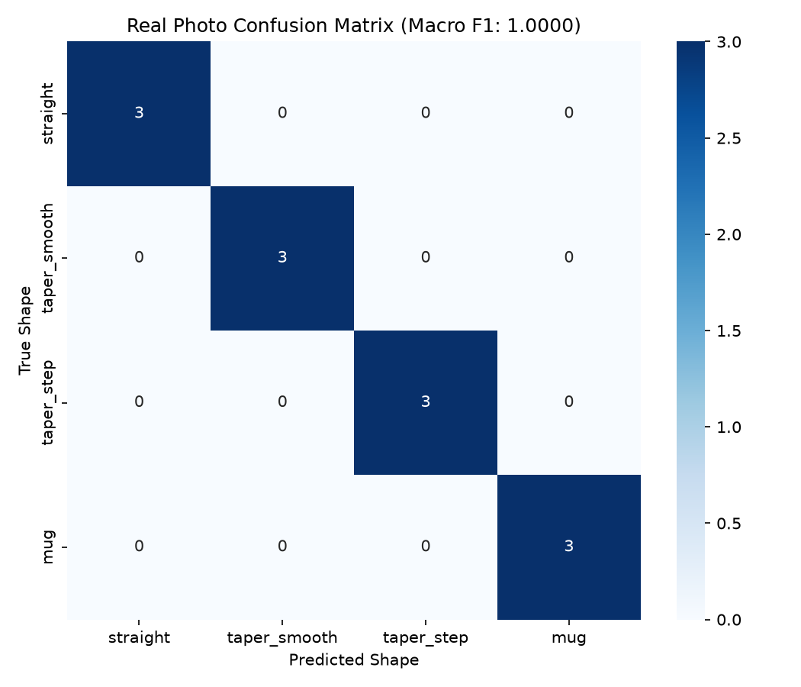

---

### (2) 모델 예측 종합 시각화 카드 예시
- **straight 판정 (99.89% 확신도)**:
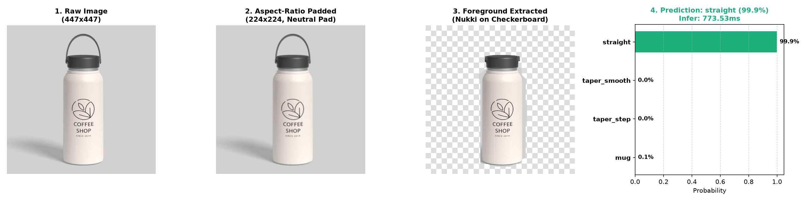

- **mug 판정 (99.91% 확신도)**:
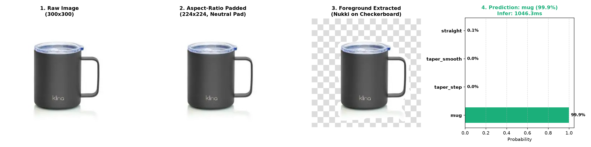

---

## 7. 단계별 연산 속도(Latency & FPS) 벤치마크

RTX 4050 Laptop GPU (CUDA 12.4, AMP fp16) 환경에서 정밀 측정한 연산 시간입니다:

| 연산 단계 | 1장당 소요 시간 (Latency) | 초당 처리량 (FPS) | 비고 |
|---|---|---|---|
| **순수 ViT 모델 GPU 추론** | **`39.18 ms`** | **`25.5 FPS`** | 배치 1 기준 전방 추론 + Softmax |
| **웹 이미지(~500px) End-to-End** | **`58.86 ms`** | **`17.0 FPS`** | 파일 로드 + 224패딩 + GPU 추론 |
| **실촬영 1200만화소(4000×3000) E2E** | **`795.39 ms` (0.8초)** | **`1.26 FPS`** | 고해상도 디코딩/리사이즈(744ms) + GPU(51ms) |
| **배경 분리 (GrabCut 누끼따기)** | **`3,745 ms` (3.7초)** | — | 448px 최적화 적용 실루엣 추출 |
| **실촬영 135장 전체 일괄 평가** | **약 `1분 56초`** | — | 135장 전처리 + 3개 모델(405회) 추론 |
| **모델 학습 (Exp B 15 에포크)** | **약 `4분 30초`** | — | 352장 Train, 조기 종료 수렴 |

---

## 8. 개별 이미지 파일 바로 열기 (클릭 시 IDE 탭에서 열림)

- [Grad-CAM 4종 형태별 시각적 판정 근거](./reports/figures/gradcam_class_explanations.png)
- [누끼 4분할 시각화](./reports/figures/nukki_segmentation_preview.png)
- [전처리 및 증강 파이프라인](./reports/figures/preprocessing_pipeline_preview.png)
- [형상 의존성 진단 결과](./reports/figures/shape_reliance_diagnosis.png)
- [중복 사진 4쌍 검출](./reports/figures/duplicate_pairs.png)
- [클래스별 4×4 샘플](./reports/figures/dataset_samples_by_class.png)
- [학습 및 검증 곡선](./reports/figures/training_curves_exp_b_seed42.png)
- [실촬영 135장 테스트셋 혼동행렬](./reports/figures/test_orientation_confusion_matrix.png)
- [실촬영 12장 혼동행렬](./reports/figures/real_test_confusion_matrix.png)
- [직선형 텀블러 예측 카드](./reports/figures/sample_prediction_straight.png)
- [머그형 텀블러 예측 카드](./reports/figures/sample_prediction_mug.png)

