# EfficientNet-B0 학습 및 평가 결과

## 1. 결론 요약

ImageNet pretrained EfficientNet-B0를 **크롤링 이미지로만 학습**한 결과,
크롤링 holdout에서는 **97.67%**, 별도 실촬영 이미지에서는 **88.10%**의
정확도를 얻었다.

| 평가 데이터 | 이미지 수 | 정확도 | Macro Precision | Macro Recall | Macro F1 |
|---|---:|---:|---:|---:|---:|
| 크롤링 holdout | 129 | **97.67%** | 97.93% | 97.59% | **97.73%** |
| 실촬영 이미지 | 126 | **88.10%** | 89.09% | 86.74% | **87.50%** |
| 차이 (크롤링 - 실촬영) | - | **9.58%p** | 8.84%p | 10.86%p | **10.23%p** |

실촬영 환경에서 분명한 성능 하락이 있지만, 실촬영 데이터를 전혀 학습하지 않은 조건에서도
111/126장을 올바르게 분류했다. 가장 안정적인 실촬영 클래스는 `taper_step`이고,
가장 낮은 recall을 보인 클래스는 `mug`이다.

## 2. 실험 설정

| 항목 | 설정 |
|---|---|
| 모델 | EfficientNet-B0 |
| 초기 가중치 | ImageNet pretrained |
| 학습 클래스 | `mug`, `straight`, `taper_smooth`, `taper_step` |
| 크롤링 전체 데이터 | 642장 |
| 크롤링 학습 데이터 | 513장 (80%) |
| 크롤링 holdout test | 129장 (20%) |
| 실촬영 test | 126장 |
| 분할 방법 | 클래스별 층화 분할, seed 42 |
| Validation set | 사용하지 않음 |
| 입력 크기 | 224×224 |
| Epoch / batch | 15 / 32 |
| Optimizer | AdamW, lr 0.0003, weight decay 0.0001 |
| Scheduler | Cosine annealing |
| 학습 장치 | NVIDIA GeForce RTX 4050 Laptop GPU |
| PyTorch | 2.14.0+cu130 |
| 학습 시간 | 약 119.6초 |

### 2.1 모델 설명 및 선정 이유

EfficientNet은 네트워크의 깊이(depth), 너비(width), 입력 해상도(resolution)를 한쪽만
증가시키는 대신 세 요소를 균형 있게 확장하는 **compound scaling**을 제안한 CNN 계열이다.
EfficientNet-B0는 이 계열의 기본 모델로, MBConv와 squeeze-and-excitation 구조를 이용해
비교적 적은 파라미터와 연산량으로 효과적인 이미지 특징을 추출한다. 본 실험에서는
ImageNet으로 사전학습된 B0의 분류기를 4개 출력 클래스에 맞는 선형 계층으로 교체하고,
전체 네트워크를 end-to-end 방식으로 fine-tuning하였다.

본 데이터는 실제 학습에 사용되는 크롤링 이미지가 513장으로 많지 않다. 이 규모에서 CNN을
처음부터 학습하면 제한된 표본에 과적합되거나 충분한 일반화 특징을 학습하지 못할 가능성이
있다. 따라서 ImageNet 사전학습 가중치가 보유한 윤곽, 질감, 형태 등의 일반적인 시각 특징을
재사용하는 전이학습을 적용하였다. 또한 B0는 EfficientNet 계열 중 가장 가벼운 기본형이므로
복잡도가 과도하지 않고 학습 속도가 빠르며, 소규모 데이터셋에서 먼저 시도할 baseline으로
적합하다고 판단하였다. 즉, EfficientNet이 적은 데이터에 본질적으로 유리하다고 단정하기보다
**사전학습된 특징과 파라미터 효율성이 제한된 데이터 조건에 적합하다**는 점을 선정 근거로
삼았다.

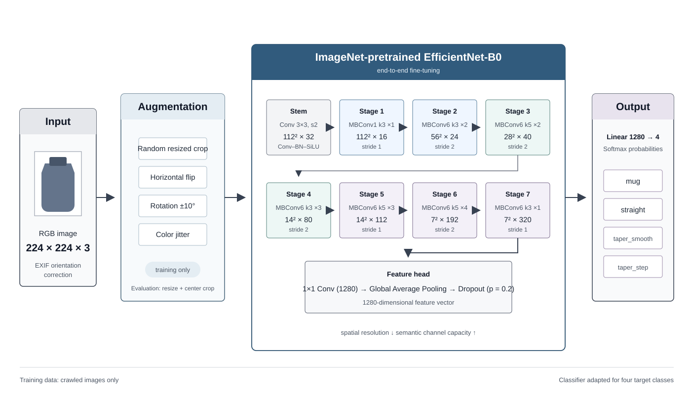

검증셋과 test 성능 기반 early stopping을 사용하지 않았다. 사전에 정한 15 epoch를 모두
학습한 마지막 모델 하나를 두 테스트셋에 동일하게 적용했으므로, holdout 성능을 이용한
모델 선택 누수는 없다.

실촬영 126장은 모두 EXIF orientation 6을 사용하고 있었다. 일반 이미지 뷰어와 동일하게
upright 상태로 평가하도록 `ImageOps.exif_transpose`를 적용했다. EXIF를 무시할 경우 이미지가
90° 회전되므로 실촬영 평가가 왜곡된다.

## 3. 학습 결과

| Epoch | Train loss | Train accuracy |
|---:|---:|---:|
| 1 | 1.1500 | 55.17% |
| 3 | 0.1967 | 94.35% |
| 5 | 0.0768 | 97.66% |
| 8 | 0.0329 | 99.22% |
| 13 | 0.0206 | 99.42% |
| 15 | 0.0254 | **99.22%** |

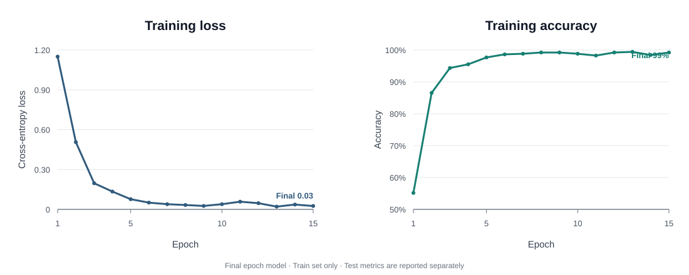

위 그래프는 **학습 데이터의 지표만** 나타낸다. 별도 validation set을 사용하지 않았으므로
validation 곡선은 없으며, 테스트 성능은 아래 두 평가 섹션에서 별도로 확인해야 한다.

학습 정확도와 크롤링 holdout 정확도의 차이는 약 1.55%p로 작다. 반면 실촬영과의 차이는
11.12%p이므로, 단순한 train overfitting보다는 크롤링 이미지와 실촬영 이미지 사이의
도메인 차이가 주요 성능 저하 요인으로 보인다.

## 4. 크롤링 holdout 평가

| 클래스 | Precision | Recall | F1 | Support |
|---|---:|---:|---:|---:|
| mug | 94.59% | 100.00% | 97.22% | 35 |
| straight | 97.14% | 97.14% | 97.14% | 35 |
| taper_smooth | 100.00% | 96.67% | 98.31% | 30 |
| taper_step | 100.00% | 96.55% | 98.25% | 29 |

129장 중 126장을 맞혔다. 오분류는 `straight → mug`, `taper_smooth → straight`,
`taper_step → mug`가 각각 1장씩이다.

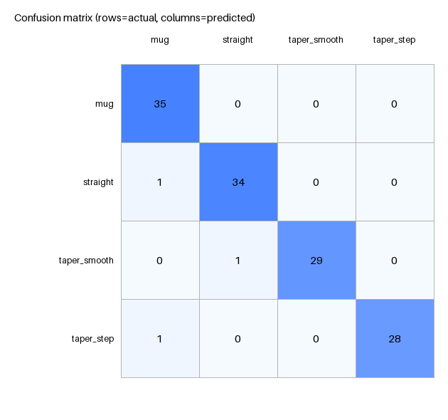

## 5. 실촬영 이미지 평가

| 클래스 | Precision | Recall | F1 | Support | 정답 수 |
|---|---:|---:|---:|---:|---:|
| mug | 94.12% | **72.73%** | 82.05% | 22 | 16 |
| straight | 87.50% | 89.74% | 88.61% | 39 | 35 |
| taper_smooth | 77.78% | 87.50% | 82.35% | 32 | 28 |
| taper_step | 96.97% | **96.97%** | 96.97% | 33 | 32 |

오류 15장의 세부 패턴은 다음과 같다.

- `mug`: 6장 오류 — `straight` 2장, `taper_smooth` 3장, `taper_step` 1장
- `straight`: 4장 모두 `taper_smooth`로 예측
- `taper_smooth`: 4장 오류 — `mug` 1장, `straight` 3장
- `taper_step`: 1장을 `taper_smooth`로 예측

실촬영에서 주요 혼동 축은 `straight ↔ taper_smooth`이고, `mug`는 다양한 형태로 분산되어
recall이 가장 낮다. `taper_step`의 단차는 비교적 강한 구분 특징으로 작동했다.

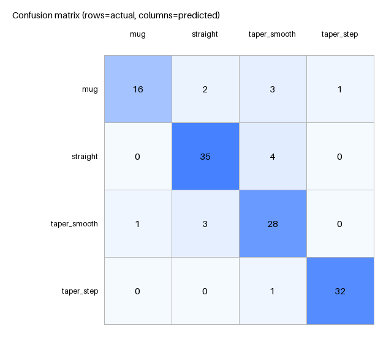

## 6. Grad-CAM 분석

Grad-CAM의 붉고 노란 영역은 해당 예측에 상대적으로 크게 기여한 위치다.

### 실촬영 데이터: 클래스별 4×4 예시

행은 **실제 클래스**, 열은 해당 클래스의 이미지 예시다. 각 셀의 괄호 안은 모델의
예측 클래스이며, 오분류도 포함했다. 동일한 평가 전처리와 최종 모델을 사용해 생성했다.

| 실제 클래스 | 예시 1 | 예시 2 | 예시 3 | 예시 4 |
|---|---|---|---|---|
| **mug** | 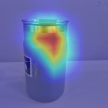  taper_smooth | 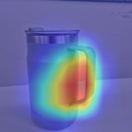  mug | 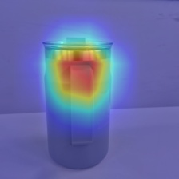  taper_smooth | 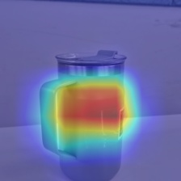  taper_step |
| **straight** | 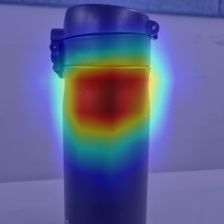  straight | 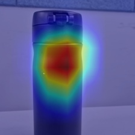  straight | 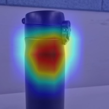  straight | 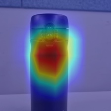  straight |
| **taper_smooth** | 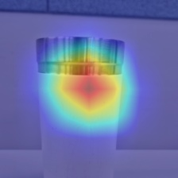  taper_smooth | 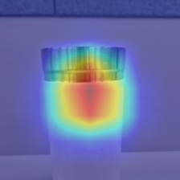  taper_smooth | 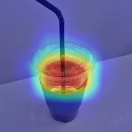  mug | 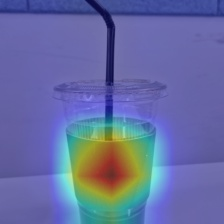  taper_smooth |
| **taper_step** | 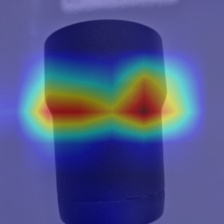  taper_step | 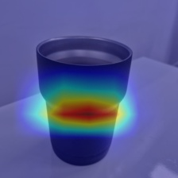  taper_step | 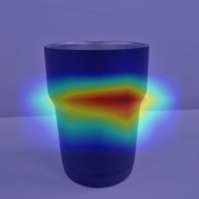  taper_step | 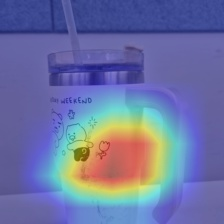  taper_step |

### 실촬영 대표 사례

| 사례 | 해석 |
|---|---|
| `mug → taper_smooth` 오분류 | 상단 림과 상부 몸통의 테이퍼 형상에 강하게 반응한다. 라벨과 하단 전체 형태는 상대적으로 덜 활용한다. |
| `straight → straight` 정답 | 본체 중앙의 직선형 실루엣과 상단 전이부에 집중한다. |
| `taper_smooth → taper_smooth` 정답 | 상단에서 몸통으로 이어지는 부드러운 폭 변화에 집중한다. |
| `taper_step → taper_step` 정답 | 몸통 중간의 좌우 단차 경계에 강하게 반응한다. |

#### Mug 오분류: 실제 mug, 예측 taper_smooth (confidence 0.792)

#### Straight 정답 (confidence 0.999)

#### Taper smooth 정답 (confidence 0.993)

#### Taper step 정답 (confidence 0.959)

전체적으로 CAM은 배경보다 제품 본체에 놓여 있어 모델이 단순 배경색만 학습한 것으로
보이지는 않는다. 다만 중앙부와 상단부에 집중하는 경향이 강하고, 일부 `mug`에서 하단
실루엣이나 라벨 같은 보조 특징을 충분히 활용하지 않는 것이 오분류 원인으로 보인다.
Grad-CAM은 인과적 설명이 아니라 국소적인 기여도 시각화이므로 위 해석은 진단 가설로
보는 것이 적절하다.

## 7. 개선 우선순위

1. 실촬영 데이터를 학습에 쓰지 않는 조건을 유지한다면, 회전·원근·조명·배경·부분 crop을
   더 강하게 모사하는 augmentation을 추가한다.
2. `mug`, `straight`, `taper_smooth`의 경계 사례를 크롤링 데이터에 보강한다. 특히
   측면 실루엣과 상·하단 형상이 모두 보이는 이미지를 우선한다.
3. 후속 실험에서는 현재 split을 그대로 보존하고 seed를 3~5개로 반복해 평균과 표준편차를
   보고한다. 현재 결과는 seed 42의 단일 split 결과다.
4. 실촬영 데이터를 사용할 수 있다면 별도 validation으로 일부만 사용해 domain adaptation
   또는 소량 fine-tuning 효과를 비교하되, 최종 test 이미지는 계속 격리한다.

## 8. 산출물

- 모델 체크포인트: `outputs/efficientnet_b0_final.pt` (약 16MB; 이 브랜치에는 포함하지 않음. 데이터와 함께 학습 코드를 재실행하면 생성됨)
- 학습 기록: [`training_history.json`](training_history.json), [epoch별 그래프](training_curves.svg)
- 전체 비교 지표: [`evaluation/comparison.json`](evaluation/comparison.json)
- 크롤링 이미지별 예측: [`evaluation/crawler_holdout/predictions.csv`](evaluation/crawler_holdout/predictions.csv)
- 실촬영 이미지별 예측: [`evaluation/real_photos/predictions.csv`](evaluation/real_photos/predictions.csv)
- 전체 Grad-CAM: [`evaluation/gradcam`](evaluation/gradcam)
